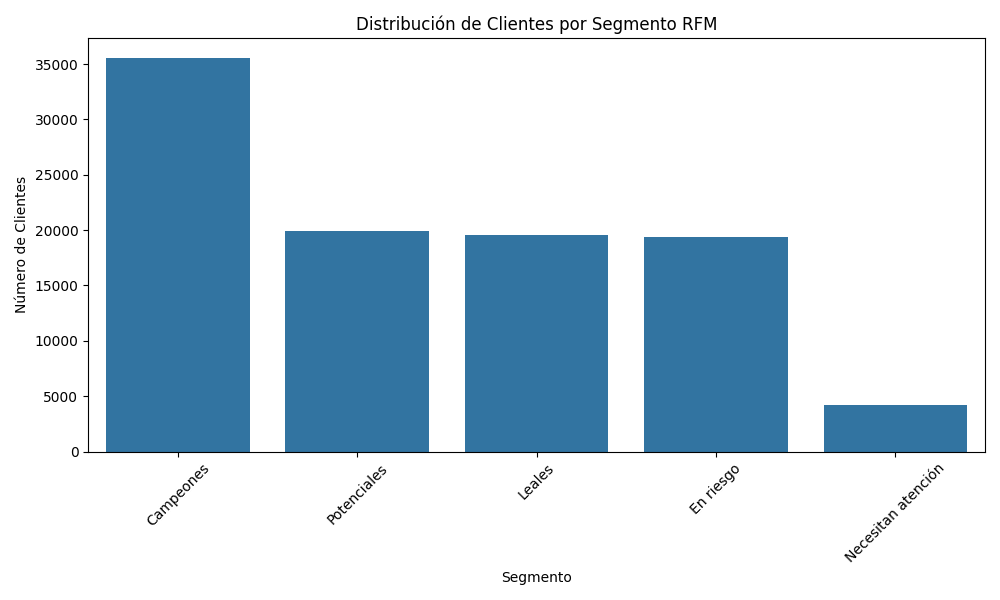
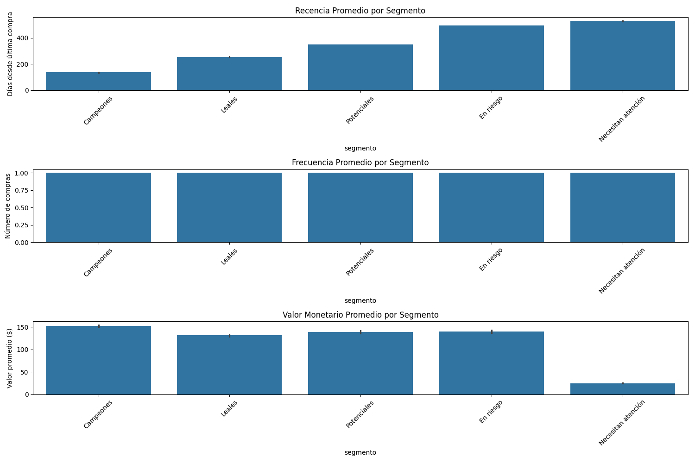

# 📊 Análisis de Datos de E-Commerce y Segmentación de Clientes (RFM) 🛍️

Este proyecto realiza un análisis exhaustivo de un conjunto de datos de e-commerce para comprender el comportamiento de los clientes y segmentarlos utilizando el modelo RFM (Recencia, Frecuencia, Valor Monetario). El objetivo principal es identificar diferentes grupos de clientes para poder aplicar estrategias de marketing personalizadas y efectivas.

## 🎯 Descripción del Proyecto

El script de Python (`nombre_de_tu_script.py`) está diseñado para realizar las siguientes tareas clave:

1.  💧 **Carga de Datos:** Importación de múltiples archivos CSV que contienen información detallada sobre:
    * Clientes
    * Pedidos
    * Productos
    * Pagos
    * Ubicaciones Geográficas
    * Vendedores
    * Artículos de Pedidos
    * Reseñas de Pedidos
2.  🧹 **Limpieza y Preparación de Datos (Data Wrangling):**
    * Verificación y reporte de valores faltantes en cada conjunto de datos.
    * Identificación y eliminación de registros duplicados.
    * Conversión de columnas de fecha/hora al formato `datetime` para análisis temporal.
    * Análisis exploratorio básico de precios (promedio, mínimo, máximo).
    * Traducción de nombres de categorías de productos del portugués al inglés para consistencia.
    * Ingeniería de características: Creación de nuevas columnas útiles como mes y año de compra, y cálculo del tiempo de entrega.
3.  📈 **Análisis RFM (Recencia, Frecuencia, Valor Monetario):**
    * Cálculo de:
        * **Recencia (R):** Días transcurridos desde la última compra del cliente.
        * **Frecuencia (F):** Número total de compras realizadas por el cliente.
        * **Valor Monetario (M):** Gasto total realizado por el cliente.
    * Segmentación de clientes en 5 categorías significativas basadas en sus puntuaciones RFM:
        * 🌟 **Campeones (Champions)**
        * 💖 **Leales (Loyal Customers)**
        * 💡 **Potenciales (Potential Loyalist)**
        * ⚠️ **En Riesgo (At Risk)**
        * 😥 **Necesitan Atención (Need Attention)**
4.  🖼️ **Visualización de Resultados:**
    * Generación de gráficos para ilustrar la distribución de clientes por cada segmento RFM.
        * *Visualización de la distribución de segmentos:*
            
    * Visualización de las métricas promedio de Recencia, Frecuencia y Valor Monetario para cada segmento, permitiendo una comparación clara de sus características.
        * *Métricas promedio RFM por segmento:*
            
5.  📤 **Exportación de Resultados:**
    * Guardado de la tabla de segmentación RFM, con cada cliente asignado a un segmento, en un archivo CSV (`segmentacion_clientes_rfm.csv`). Este archivo es ideal para su uso en campañas de marketing dirigidas u otros análisis posteriores.
    * Guardado de las visualizaciones generadas como archivos de imagen (`segmentos_rfm.png`, `metricas_por_segmento.png`).

## 📚 Conjuntos de Datos Utilizados

El análisis se basa en los siguientes archivos de datos, provenientes del [conjunto de datos de E-Commerce de Olist en Kaggle](https://www.kaggle.com/datasets/olistbr/brazilian-ecommerce):

* `olist_customers_dataset.csv`
* `olist_geolocation_dataset.csv`
* `olist_order_payments_dataset.csv`
* `olist_products_dataset.csv`
* `olist_sellers_dataset.csv`
* `olist_orders_dataset.csv`
* `olist_order_items_dataset.csv`
* `olist_order_reviews_dataset.csv`
* `product_category_name_translation.csv`

## ⚙️ Requisitos

Para ejecutar este proyecto, necesitarás tener **Python 3.x** instalado junto con las siguientes bibliotecas esenciales:

* **pandas:** Para manipulación y análisis de datos.
* **numpy:** Para operaciones numéricas.
* **matplotlib:** Para la creación de gráficos estáticos.
* **seaborn:** Para la creación de visualizaciones estadísticas más atractivas.

🔑 Resultados Clave del Análisis

Resultados Clave del Análisis📊 Valores Faltantes Identificados (Antes del Tratamiento Específico):Hemos identificado la presencia de valores faltantes en varios de los datasets principales, lo cual es un paso crucial antes de proceder con análisis más profundos:olist_products_dataset.csv: Se encontraron 2,448 registros con valores faltantes en columnas que consideramos críticas para el análisis.olist_orders_dataset.csv: Presenta 4,908 registros con valores faltantes.olist_order_reviews_dataset.csv: Contiene un número significativo de valores faltantes, alcanzando los 145,903 registros.(Nota: El script actual permite identificar estos faltantes. Las estrategias específicas de imputación o eliminación se pueden implementar según los requisitos del análisis posterior).💰 Análisis de Precios (Sobre olist_order_items_dataset.csv):Un vistazo rápido a la distribución de precios de los ítems revela lo siguiente:Precio promedio del item: $120.65 BRLPrecio mínimo del item: $0.85 BRLPrecio máximo del item: $6735.00 BRL📏 Dimensiones de los Datos (Post-Limpieza Inicial y Merge Principal para RFM):Después del proceso inicial de limpieza y la fusión de datasets necesaria para el análisis RFM, tenemos las siguientes dimensiones:Clientes únicos analizados para RFM: 98,666📈 Resultados del Análisis RFM:La aplicación del modelo RFM (Recencia, Frecuencia, Valor Monetario) a nuestra base de clientes nos arroja las siguientes métricas promedio:Recencia Media: Aproximadamente 289 días. Esto sugiere que, en promedio, los clientes realizaron su última compra hace alrededor de 9 meses dentro del período de datos analizado.Frecuencia Media: Es de 1.0. Este valor indica que la gran mayoría de los clientes analizados ha realizado una única compra. Este es un patrón común en algunos modelos de negocio de e-commerce o durante períodos de tiempo específicos.Valor Monetario Medio: Se sitúa en aproximadamente $137.75 BRL por cliente.Espero que este resumen estructurado sea útil y fácil de entender para quienes visiten tu repositorio. ¡No dudes en añadir más detalles o visualizaciones!

Distribución de Clientes por Segmento:

🌟 Campeones: 35,592 clientes
💡 Potenciales: 19,965 clientes
💖 Leales: 19,540 clientes
⚠️ En Riesgo: 19,393 clientes
😥 Necesitan Atención: 4,176 clientes
Características de los Segmentos (Medias):

| Segmento            | Recencia Media (días) | Frecuencia Media | Valor Monetario Medio (BRL) | Descripción Breve                                     |
|---------------------|-----------------------|------------------|-----------------------------|-------------------------------------------------------|
| 🌟 Campeones        | 136                   | 1.0              | $153                        | Clientes más recientes, gasto por encima del promedio. |
| 💖 Leales           | 255                   | 1.0              | $131                        | Compraron hace un tiempo moderado, gasto promedio.    |
| 💡 Potenciales      | 348                   | 1.0              | $139                        | Compraron hace más tiempo, gasto promedio.            |
| ⚠️ En Riesgo        | 493                   | 1.0              | $140                        | No han comprado en mucho tiempo, gasto promedio.      |
| 😥 Necesitan Atención | 528                   | 1.0              | $25                         | Clientes más antiguos y con el menor gasto.          |

📢 Recomendaciones de Marketing Sugeridas
Basándose en la segmentación RFM, se pueden proponer las siguientes estrategias:

🌟 Campeones:
Implementar programas de fidelización VIP.
Ofrecer acceso anticipado a nuevos productos o colecciones.
Incentivarlos a convertirse en embajadores de marca (e.g., mediante reseñas o referidos).

💖 Leales:
Fomentar la venta cruzada (cross-selling) y el up-selling con productos complementarios o de mayor valor.
Implementar programas de referidos para que atraigan nuevos clientes.
Solicitar reseñas de productos y servicios.

💡 Potenciales:
Enviar ofertas personalizadas basadas en su historial de compras anteriores.
Ofrecer incentivos para aumentar la frecuencia de compra (e.g., descuentos por segunda compra).
Comunicar novedades y beneficios de seguir comprando.

⚠️ En Riesgo:
Lanzar campañas de reactivación con descuentos especiales o promociones exclusivas.
Recordarles el valor y los beneficios de la marca.
Realizar encuestas para entender por qué no han vuelto a comprar.

😥 Necesitan Atención:
Enviar recordatorios amigables y ofertas de "bienvenida de nuevo" muy atractivas.
Ofrecer un incentivo significativo para incentivar una recompra y evaluar si se pueden recuperar.
Considerar si es coste-efectivo intentar reactivar a todos los clientes de este segmento o enfocarse en aquellos con mayor potencial de gasto pasado.

🚀 Futuras Mejoras / Próximos Pasos
Manejo Avanzado de Valores Faltantes: Implementar estrategias más robustas como la imputación múltiple o modelos predictivos para rellenar datos faltantes.
Análisis de Outliers: Realizar un análisis de outliers más detallado en las métricas RFM y aplicar técnicas de tratamiento si es necesario (e.g., winsorización).
Optimización de Segmentación RFM: Explorar diferentes métodos de puntuación (e.g., basados en percentiles fijos o k-means clustering sobre las métricas RFM) y variar el número de umbrales/segmentos.
Profundización en EDA:
Análisis de los productos más vendidos por segmento.
Análisis geográfico de los clientes y su impacto en el comportamiento de compra.
Identificación de tendencias temporales en ventas y comportamiento de clientes.
Análisis de la efectividad de diferentes métodos de pago.
Modelado Predictivo:
Desarrollar modelos para predecir el abandono de clientes (Churn Prediction).
Estimar el Valor de Vida del Cliente (Customer Lifetime Value - CLV).
Construir sistemas de recomendación de productos.

